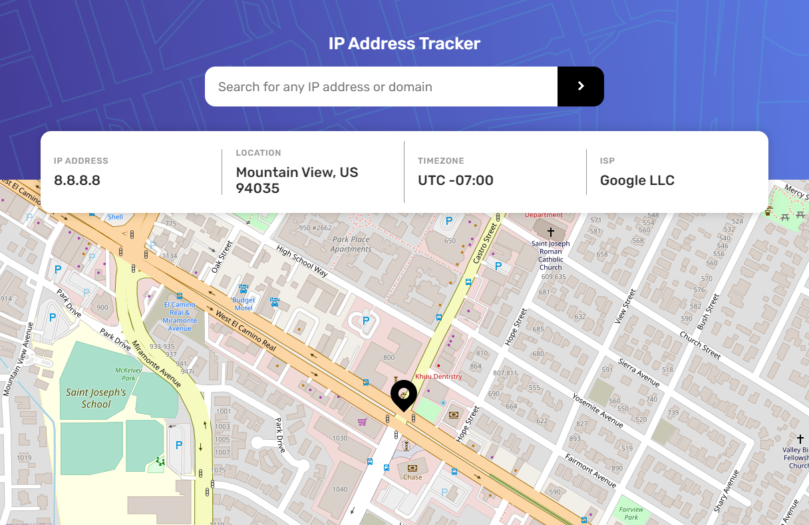
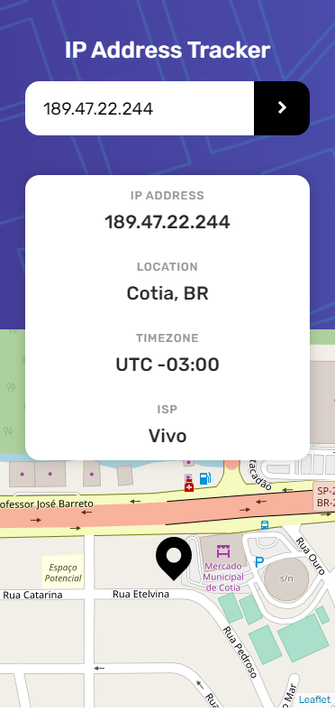

# IP-address-tracker

That project shows the location on a map through an IP address.

In this implementation, I used the IP Geolocation API to obtain the Country, City, ISP, and Latitude and Longitude through the user's IP.

And with Latitude and Longitude, pass them through the Leaflet Map to show the exact location on the map. 

[Geolocation API](https://geo.ipify.org/)

[Leaflet Map](https://leafletjs.com/)

[This is a challenge of FrontEnd Mentor](https://www.frontendmentor.io/challenges/ip-address-tracker-I8-0yYAH0).

## Result

> ### See the result live [here](https://ip-address-tracker-lusk1nha.vercel.app/)

Desktop Version -

Mobile Version -

